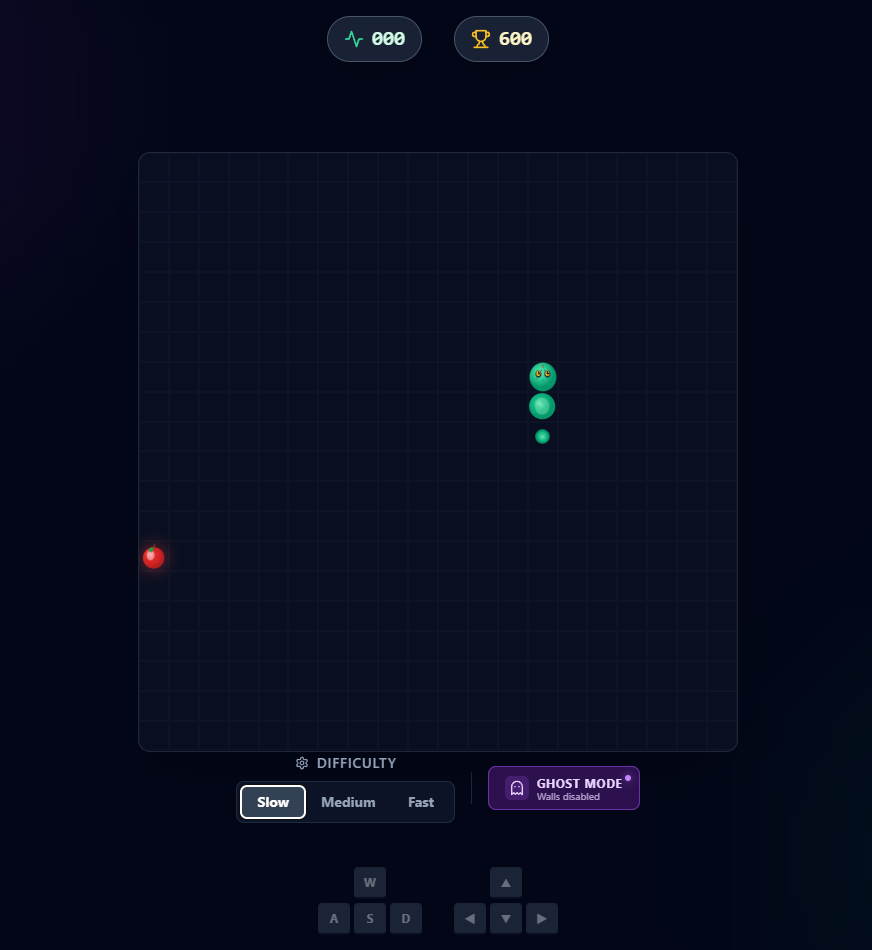

# Neon Snake Game 🐍

A modern, visually stunning implementation of the classic Snake game built with React, Vite, and Tailwind CSS.



## ✨ Features

- **Modern Visuals**: Neon aesthetic with glassmorphism effects and dynamic gradients.
- **Realistic Graphics**: 
  - 🐍 Snake features a rounded head with expressive eyes and a textured, segmented body.
  - 🍎 Food is rendered as a detailed red apple with stem and leaf.
- **Difficulty Modes**: Choose your challenge level:
  - **Slow**: Relaxed gameplay (200ms)
  - **Medium**: Balanced speed (150ms)
  - **Fast**: High-speed challenge (100ms)
- **Responsive Controls**: Support for both WASD and Arrow keys.
- **Score Tracking**: Real-time score and high score persistence.
- **Passthrough Mode (Ghost Mode)**: Toggleable option to wrap around walls instead of crashing.

## 🛠 Prerequisites

To run this project, you need to have **Node.js** installed on your system.
- [Download Node.js](https://nodejs.org/) (Version 16+ recommended)

## 🚀 Getting Started

We've provided a simple automated script to get you running in seconds.

### Automatic Setup (Windows)

1. Double-click the `setup_and_run.bat` file in the project folder.
2. The script will automatically:
   - Check for Node.js
   - Install dependencies (if needed)
   - Start the game server

### Manual Setup

If you prefer using the command line:

1. Install dependencies:
   ```bash
   npm install
   ```

2. Start the development server:
   ```bash
   npm run dev
   ```

3. Open your browser and visit `http://localhost:5173`

### Docker Setup 🐳

You can also run the game using Docker:

1. Build and start the container:
   ```bash
   docker-compose up -d --build
   ```

2. Open your browser and visit `http://localhost:8080`

3. To stop the container:
   ```bash
   docker-compose down
   ```

## 🎮 How to Play

- **Arrow Keys** or **WASD** to move.
- **Space** to Pause/Resume.
- Eat the **Apples** to grow and earn points.
- Avoid hitting the walls or yourself (unless Ghost Mode is ON!).
- Select **Difficulty** at the bottom of the screen to change game speed.
- Toggle **Ghost Mode** to enable/disable wall wrapping.

## 💻 Tech Stack

- **Framework**: React + Vite
- **Styling**: Tailwind CSS
- **Icons**: Lucide React
- **Animations**: Framer Motion
